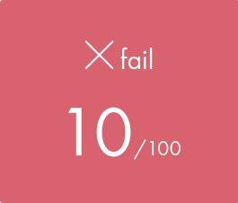
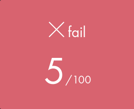
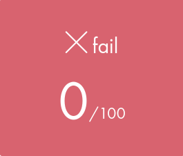

# Piscine 42 Lyon - July 2025

## Projects

  
### Shell 00

| | Grade | Moulinette | Notes | Submit commit |
| ----------- | ---------------- | ---------------------------- | ------------------ | ----------- |
| ***First try*** |  | <pre><code>ex00: OK &#8739; ex01: OK &#8739; &#13;ex02: KO &#8739; ex03: OK &#8739; &#13;ex04: OK &#8739; ex05: OK &#8739; &#13;ex06: KO &#8739; ex07: OK &#8739; &#13;ex08: Nothing turned in &#8739; &#13;ex09: Nothing turned in</code></pre> | <ul><li>**ex02:** Forgot physical links between 3 and 5 + Wrong timestamp on 6 </li><li>**ex06:** Wrong command</li></ul> | [&lt;b8232d3&gt;](https://github.com/TimEtOff/Piscine42/tree/b8232d3/shell00) |
| ***Retry 1*** |  | <pre><code>ex00: OK &#8739; ex01: OK &#8739; &#13;ex02: OK &#8739; ex03: OK &#8739; &#13;ex04: OK &#8739; ex05: OK &#8739; &#13;ex06: OK &#8739; ex07: OK &#8739; &#13;ex08: OK &#8739; ex09: KO</code></pre> | <ul><li>**ex09:** Should display `42 file` instead of `42 File`, fixed in [&lt;main&gt;](https://github.com/TimEtOff/Piscine42/tree/main/shell00), not tested.</li></ul> | [&lt;b48c470&gt;](https://github.com/TimEtOff/Piscine42/tree/b48c470/shell00) |

[See subject](https://github.com/TimEtOff/Piscine42/blob/main/shell00/en.subject.pdf)

Basic shell commands to understand how the computer and files work, and learning to navigate them only via terminal.

---

  
### Shell 01

| | Grade | Moulinette | Notes | Submit commit |
| ----------- | ---------------- | ---------------------------- | ------------------ | ----------- |
| ***First try*** |  | <pre><code>ex01: OK &#8739; ex02: OK &#8739; &#13;ex03: OK &#8739; ex04: OK &#8739; &#13;ex05: OK &#8739; ex06: OK &#8739; &#13;ex07: KO &#8739; ex08: KO</code></pre> | <ul><li>**ex07:** Worked in my tests but didn't with in evaluations. `sed` expression should be in quotes and not `{}`, fixed in [&lt;main&gt;](https://github.com/TimEtOff/Piscine42/tree/main/shell00), not tested. </li><li>**ex08:** Tried but did not finish.</li></ul> | [&lt;5e9358a&gt;](https://github.com/TimEtOff/Piscine42/tree/5e9358a/shell01) |

[See subject](https://github.com/TimEtOff/Piscine42/blob/main/shell01/en.subject.pdf)

Harder shell commands and scripts that can be quite complex.

---

  
### C 00

| | Grade | Moulinette | Notes | Submit commit |
| ----------- | ---------------- | ---------------------------- | ------------------ | ----------- |
| ***First try*** |  | <pre><code>ex00: OK &#8739; ex01: OK &#8739; &#13;ex02: OK &#8739; ex03: OK &#8739; &#13;ex04: OK &#8739; ex05: OK &#8739; &#13;ex06: Does not compile &#8739; &#13;ex07: KO &#8739; &#13;ex08: Does not compile</code></pre> | <ul><li>**ex06:** The include for `write` was commented</li><li>**ex07:** Forgot for negative numbers</li><li>**ex08:** Abandonned</ul> *Ex06 and 07 fixed in [&lt;main&gt;](https://github.com/TimEtOff/Piscine42/tree/main/c00), not tested* | [&lt;5d84fe9&gt;](https://github.com/TimEtOff/Piscine42/tree/5d84fe9/c00) |

[See subject](https://github.com/TimEtOff/Piscine42/blob/main/c00/en.subject.pdf)

To learn the basics of C languague, mainly with the `write` function *(`unistd.h`)*, `char`s and `int`s.

---

  
### C 01

| | Grade | Moulinette | Notes | Submit commit |
| ----------- | ---------------- | ---------------------------- | ------------------ | ----------- |
| ***First try*** |  | <pre><code>ex00: OK &#8739; ex01: OK &#8739; &#13;ex02: OK &#8739; ex03: OK &#8739; &#13;ex04: OK &#8739; ex05: OK &#8739; &#13;ex06: OK &#8739; ex07: OK &#8739; &#13;ex08: OK</code></pre> | Perfect  *Notes: tests in ex08 are wrong but are working, fixed in [&lt;main&gt;](https://github.com/TimEtOff/Piscine42/tree/main/c01)* | [&lt;7d80b5a&gt;](https://github.com/TimEtOff/Piscine42/tree/7d80b5a/c01) |

[See subject](https://github.com/TimEtOff/Piscine42/blob/main/c01/en.subject.pdf)

The first time we use pointers and learn about them.

---

  
### C 02

| | Grade | Moulinette | Notes | Submit commit |
| ----------- | ---------------- | ---------------------------- | ------------------ | ----------- |
| ***First try*** |  | <pre><code>ex00: OK &#8739; ex01: KO &#8739; &#13;ex02: KO &#8739; ex03: OK &#8739; &#13;ex04: OK &#8739; ex05: OK &#8739; &#13;ex06: OK &#8739; ex07: OK &#8739; &#13;ex08: OK &#8739; ex09: KO &#8739; &#13;ex10: KO &#8739; ex11: KO &#8739; &#13;ex12: KO</code></pre> | <ul><li>**ex01:** Should fill empty characters with null-terminators `\0`</li><li>**ex02:** Read the subject as "alphanumeric" but was actually only alpha</li><li>**ex09:** Misread the subject, other letters should all be lowercase</li><li>**ex10:** Idk</li><li>**ex11:** Should be able to handle `unsigned char`s (extended ASCII table)</li><li>**ex12:** Same as *ex11*</li></ul>*Notes: Should be fixed in [&lt;main&gt;](https://github.com/TimEtOff/Piscine42/tree/main/c02), not tested.* | [&lt;7b869bb&gt;](https://github.com/TimEtOff/Piscine42/tree/7b869bb/c02) |
| ***Retry 1*** |  | <pre><code>ex00: OK &#8739; ex01: KO &#8739; &#13;ex02: OK &#8739; ex03: OK &#8739; &#13;ex04: OK &#8739; ex05: OK &#8739; &#13;ex06: OK &#8739; ex07: OK &#8739; &#13;ex08: OK &#8739; ex09: OK &#8739; &#13;ex10: OK &#8739; ex11: OK &#8739; &#13;ex12: KO</code></pre> | <ul><li>**ex01:** No idea</li><li>**ex12:** No idea</li></ul> | [&lt;885529a&gt;](https://github.com/TimEtOff/Piscine42/tree/885529a/c02) |

[See subject](https://github.com/TimEtOff/Piscine42/blob/main/c02/en.subject.pdf)

Basic string manipulation with copy or detection of certain types of characters. Lot of copy-paste. Understanding the functions that we need to copy is hard at first, and you should really pay attention to everything in the subject and the `man`.

---

  
### C 03

| | Grade | Moulinette | Notes | Submit commit |
| ----------- | ---------------- | ---------------------------- | ------------------ | ----------- |
| ***First try*** |  | <pre><code>ex00: OK &#8739; ex01: KO &#8739; &#13;ex02: OK &#8739; ex03: KO &#8739; &#13;ex04: KO &#8739; ex05: KO</code></pre> | <ul><li>**ex01:** [SegFault] Probably pointers</li><li>**ex03:** Null-terminators *(see c02 first try)* or pointers</li><li>**ex04:** Idk, probably pointers</li><li>**ex05:** Didn't really understand `strlcat`</li></ul> | [&lt;20565f8&gt;](https://github.com/TimEtOff/Piscine42/tree/20565f8/c03) |

[See subject](https://github.com/TimEtOff/Piscine42/blob/main/c03/en.subject.pdf)

More advanced string manipulation but many times the same function with only some slight variations.

---

## Exams

Exams are, as you can guess, exams. They take place for 4 hours, the Fridays from 4PM to 8PM. You are free to finish whenever you want.   
During the exam, you are alone on the computer, you cannot use the internet, your previous projects nor speak with the others. You can have a blank paper and a pen to take notes.   
Even though you can use whatever text editor/IDE you want on the projects, in exam, you can only use the Terminal, Vim, Emacs & Nano, so be sure to remember everything you think will be useful, or at least know where to search.

  
### Exam 00

First exam at the end of the first week. Should be relatively easy and revolves mainly around the `write` function in C and the notions in [C00](#c-00) and [C01](#c-01).  
As I not enough prepared, I completely froze on the first exercise, it was really easy, just print a character with the `write` function, but I didn't know the name of the library to include (`unistd.h`), and after two hours of tries and labor, I finally abandonned, that resulted in this grade (yes it's considered as a success anyway for whatever reason):  
***Projects notions:*** *shell00, c00-01/02?*  
|  |
| --- |

---

### Exam 01

Mainly about string manipulation, still the `write` function and arguments in the main function (`argc, argv`). 
Was pretty easy even tough not everyone went to c06 at the time, so plenty of people din't know how to handle arguments.  
***Projects notions:*** *exam00, c02-c06*  
|  |
| --- |

---

## Rushs

Rushs are projects in randomly generated groups, where you need to work in cooperation to complete your subject.   
There will be only one correction, not by other pisciners but by members of the staff, and every member of the group should know how to explain the program clearly, as it will be graded "in particular on the group's least solid explanations".

  
### Rush 00

| Grade | Notes | Submit commit |
| ---------------- | ------------------ | ----------- |
|  | Everything worked great but we got flagged for the Norm because of the commented `main` test function in [`ft_putchar.c`](https://github.com/TimEtOff/Piscine42/tree/73badae/rush00/ex00/ft_putchar.c) (only copy-pasted it from [C 00](#c-00)). | [&lt;73badae&gt;](https://github.com/TimEtOff/Piscine42/tree/73badae/rush00) |

**Evaluation**
> "Projet fonctionnel avec tous les sujets (bonus) fait. Le code est pas mal, avec des bonnes idees! Quelques petits points d'ameliorations pas tres importants auraient pu etre applique mais rien de tres ouf. Attention a la norme, lisez le pdf, la norminette ne check pas tout! Bon courrage pour la suite!" - [lcottet](https://profile.intra.42.fr/users/lcottet)

*With [dbeal](https://profile.intra.42.fr/users/dbeal) and [talbart](https://profile.intra.42.fr/users/talbart)*

[See subject](https://github.com/TimEtOff/Piscine42/blob/main/rush00/en.subject.pdf)

[Project description here]

---

### Rush 01

| Grade | Notes | Submit commit |
| ---------------- | ------------------ | ----------- |
|  | We didn't finish the project and a lot of things were wrongly done, we didn't expect more. | [&lt;2cb6ec8&gt;](https://github.com/TimEtOff/Piscine42/tree/2cb6ec8/rush01) |

**Evaluation**
> "Début de projets : plein d’idées, une bonne logique de backtrak et de récursivité, les explications sont bien faites, à part ça rien à redire.    Problèmes : malloc mal sécurisé/inutile, la remontée d’erreur  peut etre meilleur , utilisation de variables globales inutiles, lire la norme, les commits  en français, le programme alloue avant de checker le parsing, pas mal de bouts de scotch (chiffres « magique »), mais une bonne résilience, vous avez  essayé jusqu’au bout. Bon courage pour la piscine !" - [pnaessen](https://profile.intra.42.fr/users/pnaessen)

*With [tgonthie](https://profile.intra.42.fr/users/tgonthie) and [cobussie](https://profile.intra.42.fr/users/cobussie)*

[See subject](https://github.com/TimEtOff/Piscine42/blob/main/rush00/en.subject.pdf)

[Project description here]

---
